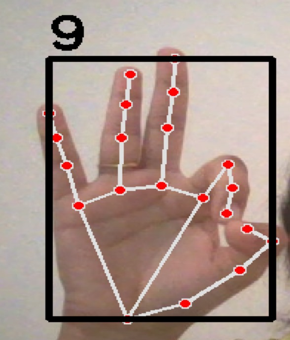

# Hand Landmark Analysis for Alphabet Gesture Interpretation

## 🚀 Project Overview

This project created a real-time system that translates hand signs (A-Z) into text. It's designed to help individuals with hearing and speech impairments communicate more easily using gestures.

## ✨ Key Features

* **Real-time Gesture Recognition:** Detects hand signs for the English alphabet instantly.
* **Assistive Technology:** Provides a visual aid for communication.
* **Core AI Skills:** Uses Computer Vision and Machine Learning (Random Forest) for hand landmark analysis.

## 🛠️ Technologies

* Python
* MediaPipe
* OpenCV
* scikit-learn

# My Awesome Project

## 📈 Demo

A screenshot of the final output:
assests/Letter - A.jpg
assests/Letter - U.jpg

